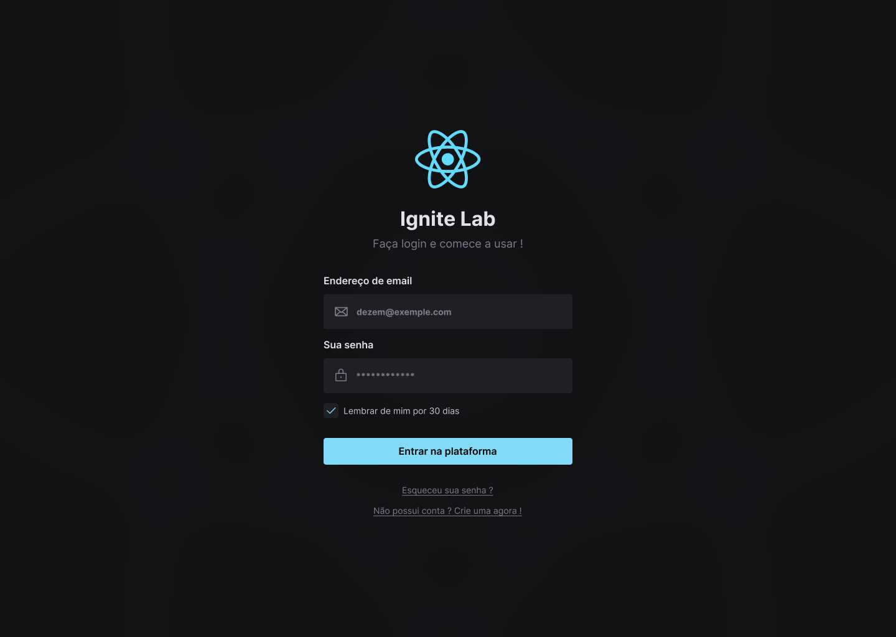

# Ignite Lab 3 - Design System

> Projeto desenvolvido no **Ignite Lab 3** da Rocketseat. A aplicação foi desenvolvida por completa, desde o projeto dentro do Figma, criando todo o Design System até a construção em React.JS e finalizando com a documentação dos componentes utilizando o Storybook.

 

## Aula 01 | Estrutura visual do Design System

Criação da estrutura visual do *Design System* no *Figma*.

Padronização da paleta de cores que será utilizada em todo o projeto.

Definição de componentes que irão fazer parte da biblioteca em *REACT*.

Agrupamento de elementos dentro do *Figma* capaz de se comportar de forma semelhante ao *display flex* do *CSS*

## Aula 02 | Do Figma ao React, criando aplicação

Exportação dos *tokens* e componentes do *Figma* para o código criado no projeto *REACT*.

Documetação sendo criada utilizando *Storybook*

## Aula 03 | Testando e automatizando

Envio do código para o *Github* e automatização do processo de publicação da documentação do *Storybook* no *Github pages* através das *Actions* do *Github*

Utilização dos componentes criados na aula anterior para o desenvolvimento da pagina de *login* de acordo com as especificações definidas previamente no *Figma*

 

## Tecnologias e ferramentas utilizadas
- React.JS (Vite)
- TypeScript
- Radix UI
- Tailwind CSS
- Clsx
- Storybook
- Addon A11y
- Github Actions

Para acessar a documentação no Storybook [Clique aqui!](https://dezemm.github.io/ignite-lab-design-system)
